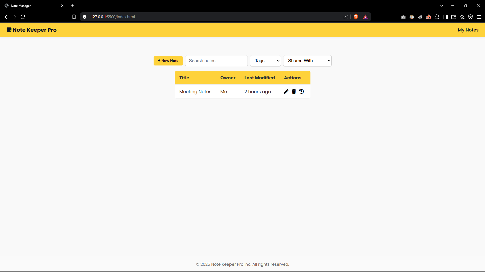
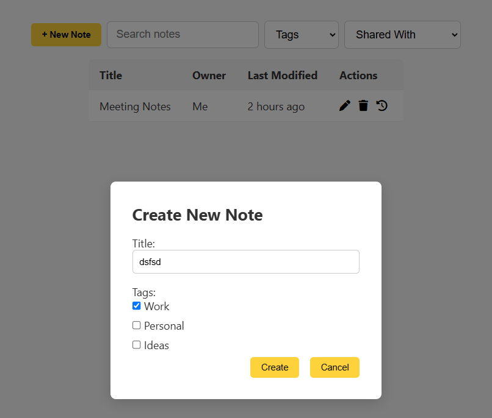
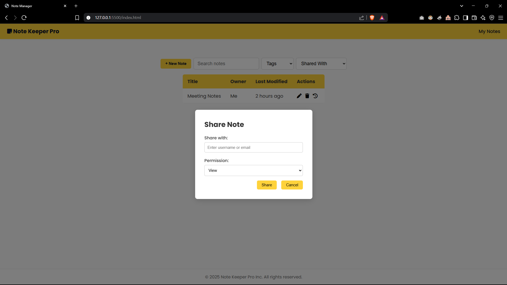
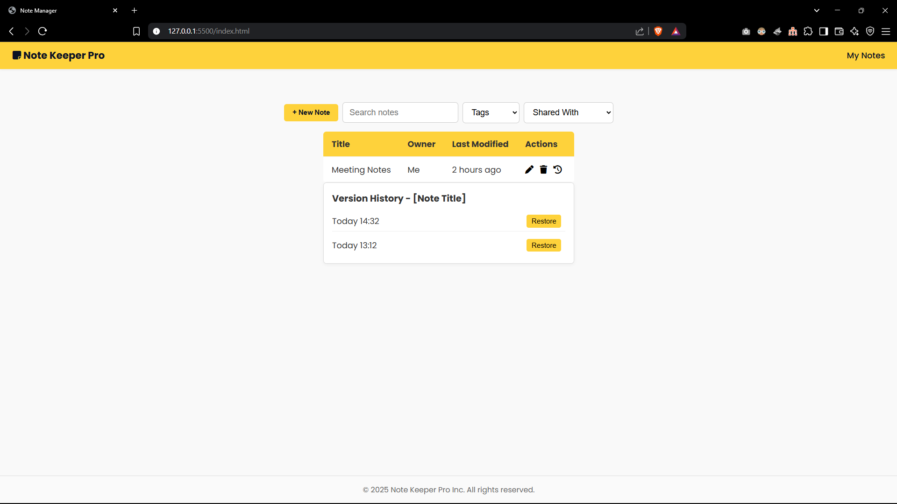
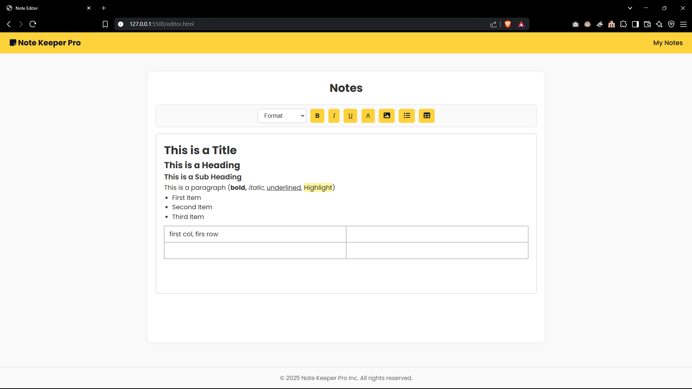

# Note Keeper

A Spring Boot note-taking web application with user registration/login, note creation/editing, note tagging, version history, restore, and note sharing permissions.

## Table of Contents

- [Features](#features)
- [Tech Stack](#tech-stack)
- [Architecture / Folder Structure](#architecture--folder-structure)
- [Getting Started](#getting-started)
- [Configuration](#configuration)
- [API Documentation](#api-documentation)
- [Frontend Screens and Flows](#frontend-screens-and-flows)
- [Usage Examples](#usage-examples)
- [Screenshots](#screenshots)
- [Build](#build)

## Features

- User registration.
- User login.
- Create notes with title, content, owner user ID, and tag.
- View notes owned by a user.
- View notes shared with a user.
- Edit note title, content, and tag.
- Store note versions when notes are created or updated.
- View note version history.
- Restore a previous note version.
- Share notes with another registered user by email.
- Supports note sharing permissions:
  - `VIEW`
  - `EDIT`
- Supports note tags:
  - `PERSONAL`
  - `WORK`
  - `STUDY`
  - `IMPORTANT`
  - `IDEA`
  - `OTHER`
- Static frontend served by Spring Boot.
- Frontend note search and tag filtering.
- Reusable static navbar and footer loaded with JavaScript components.

## Tech Stack

### Backend

- Java 21
- Spring Boot 3.4.5
- Spring Web
- Spring Data JPA
- Hibernate
- MySQL
- Maven
- Maven Wrapper

### Frontend

- HTML
- CSS
- JavaScript ES Modules
- Browser `localStorage`
- Font Awesome CDN
- Google Fonts: Poppins

### Testing

- JUnit 5
- Spring Boot Test

## Architecture / Folder Structure

The repository is structured to follow Clean Architecture.

```text
ahmedellkady-note-keeper/
├── README.md
├── mvnw
├── mvnw.cmd
├── pom.xml
├── .mvn/
│   └── wrapper/
│       └── maven-wrapper.properties
└── src/
    ├── main/
    │   ├── java/com/example/note_keeper/
    │   │   ├── NoteKeeperApplication.java
    │   │   ├── application/
    │   │   │   ├── dto/
    │   │   │   └── service/
    │   │   ├── domain/
    │   │   │   ├── model/
    │   │   │   └── repository/
    │   │   ├── infrastructure/
    │   │   │   └── persistence/
    │   │   │       ├── entity/
    │   │   │       └── repository/
    │   │   └── web/
    │   │       ├── controller/
    │   │       └── exception/
    │   └── resources/
    │       ├── application.properties
    │       └── static/
    │           ├── auth.html
    │           ├── index.html
    │           ├── editor.html
    │           ├── components/
    │           ├── css/
    │           └── js/
    └── test/
        └── java/com/example/note_keeper/
```

### Layer Overview

| Layer | Path | Responsibility |
|---|---|---|
| Application | `application/dto`, `application/service` | Request/response DTOs and business use cases |
| Domain | `domain/model`, `domain/repository` | Plain domain models and repository interfaces |
| Infrastructure | `infrastructure/persistence` | JPA entities and repository adapters |
| Web | `web/controller`, `web/exception` | REST API controllers and exception handling |
| Static UI | `src/main/resources/static` | HTML/CSS/JS frontend served by Spring Boot |

## Getting Started

### Prerequisites

Install:

- JDK 21
- MySQL
- Git

Maven does not need to be installed globally because the repository includes Maven Wrapper scripts.

### 1. Clone the Repository

```bash
git clone <https://github.com/ahmedellkady/Note-Keeper.git>
cd note-keeper
```

### 2. Create the MySQL Database

```sql
CREATE DATABASE note_keeper;
```

### 3. Configure Database Connection

Open:

```text
src/main/resources/application.properties
```

Default database configuration in the repository:

```properties
spring.datasource.url=jdbc:mysql://localhost:3306/note_keeper?useSSL=false&serverTimezone=UTC
spring.datasource.username=root
spring.datasource.password=
```

Update the username and password if your local MySQL setup is different.

### 4. Run the Application

On macOS/Linux:

```bash
./mvnw spring-boot:run
```

On Windows:

```bash
mvnw.cmd spring-boot:run
```

The application is configured to run on:

```text
http://localhost:8080
```

### 5. Open the Frontend

Open the authentication page:

```text
http://localhost:8080/auth.html
```

Main notes page:

```text
http://localhost:8080/index.html
```

Note editor page:

```text
http://localhost:8080/editor.html
```

## Configuration

No `.env` or `.env.example` file is present in the uploaded repository snapshot. Configuration is currently stored in `src/main/resources/application.properties`.

| Key | Current Value | Description | Required |
|---|---:|---|---|
| `spring.application.name` | `note-keeper` | Spring Boot application name | Yes |
| `spring.datasource.url` | `jdbc:mysql://localhost:3306/note_keeper?useSSL=false&serverTimezone=UTC` | MySQL JDBC connection URL | Yes |
| `spring.datasource.username` | `root` | MySQL database username | Yes |
| `spring.datasource.password` | empty | MySQL database password | Depends on local DB |
| `spring.datasource.driver-class-name` | `com.mysql.cj.jdbc.Driver` | MySQL JDBC driver | Yes |
| `spring.jpa.hibernate.ddl-auto` | `update` | Hibernate schema update strategy | Yes |
| `spring.jpa.show-sql` | `true` | Prints SQL queries in logs | Optional |
| `spring.jpa.properties.hibernate.dialect` | `org.hibernate.dialect.MySQL8Dialect` | Hibernate MySQL dialect | Yes |
| `server.port` | `8080` | HTTP server port | Yes |

## API Documentation

Base URL:

```text
http://localhost:8080/api
```

Authentication is not token-based in the current repository snapshot. The frontend stores the returned user object in `localStorage`.

### Users

#### Register User

```http
POST /api/users/register
```

Request body:

```json
{
  "name": "Ahmed",
  "email": "ahmed@example.com",
  "password": "password123"
}
```

Success response:

```json
{
  "id": 1,
  "name": "Ahmed",
  "email": "ahmed@example.com"
}
```

Error response:

```text
Email already exists
```

#### Login User

```http
POST /api/users/login
```

Request body:

```json
{
  "email": "ahmed@example.com",
  "password": "password123"
}
```

Success response:

```json
{
  "id": 1,
  "name": "Ahmed",
  "email": "ahmed@example.com"
}
```

Error response:

```text
Invalid credentials
```

### Notes

#### Create Note

```http
POST /api/notes/add
```

Request body:

```json
{
  "title": "My First Note",
  "content": "<h1>Start writing...</h1>",
  "userId": 1,
  "tag": "STUDY"
}
```

Success response:

```json
{
  "id": 1,
  "title": "My First Note",
  "content": "<h1>Start writing...</h1>",
  "createdAt": "2026-04-26T20:00:00",
  "updatedAt": "2026-04-26T20:00:00",
  "tag": "STUDY"
}
```

Note: `NoteRequest` contains `getTag()` but the setter method appears to be named `getTag(NoteTag tag)` instead of `setTag(NoteTag tag)`. Verify JSON binding for the `tag` field before relying on tag creation.

#### Get Notes by User

```http
GET /api/notes/{userId}/notes
```

Example:

```http
GET /api/notes/1/notes
```

Success response:

```json
[
  {
    "id": 1,
    "title": "My First Note",
    "content": "<h1>Start writing...</h1>",
    "permission": "OWNER",
    "sharedWithName": "Ahmed",
    "createdAt": "2026-04-26T20:00:00",
    "updatedAt": "2026-04-26T20:00:00",
    "tag": "STUDY"
  }
]
```

#### Update Note

```http
PUT /api/notes/update/{id}
```

Example:

```http
PUT /api/notes/update/1
```

Request body:

```json
{
  "title": "Updated Note Title",
  "content": "<p>Updated note content.</p>",
  "tag": "WORK"
}
```

Success response:

```json
{
  "id": 1,
  "title": "Updated Note Title",
  "content": "<p>Updated note content.</p>",
  "createdAt": "2026-04-26T20:00:00",
  "updatedAt": "2026-04-26T20:15:00",
  "tag": "WORK"
}
```

#### Get Note Versions

```http
GET /api/notes/{noteId}/versions
```

Example:

```http
GET /api/notes/1/versions
```

Success response:

```json
[
  {
    "id": 1,
    "title": "My First Note",
    "content": "<h1>Start writing...</h1>",
    "createdAt": "2026-04-26T20:00:00"
  }
]
```

#### Restore Note Version

```http
PUT /api/notes/{noteId}/restore/{versionId}
```

Example:

```http
PUT /api/notes/1/restore/1
```

Success response:

```json
{
  "id": 1,
  "title": "My First Note",
  "content": "<h1>Start writing...</h1>",
  "createdAt": "2026-04-26T20:00:00",
  "updatedAt": "2026-04-26T20:20:00",
  "tag": "STUDY"
}
```

#### Share Note

```http
POST /api/notes/{noteId}/share
```

Example:

```http
POST /api/notes/1/share
```

Request body:

```json
{
  "sharedWithUserEmail": "friend@example.com",
  "permission": "VIEW"
}
```

Success response:

```text
200 OK
```

Supported permission values:

```text
VIEW
EDIT
```

## Frontend Screens and Flows

### Authentication Page

File:

```text
src/main/resources/static/auth.html
```

JavaScript:

```text
src/main/resources/static/js/pages/auth.js
```

Supported flows:

- Register user.
- Login user.
- Store logged-in user in browser `localStorage`.
- Redirect successful login to `index.html`.

### Notes Dashboard

File:

```text
src/main/resources/static/index.html
```

JavaScript:

```text
src/main/resources/static/js/pages/index.js
```

Supported flows:

- Redirect to `auth.html` if no user exists in `localStorage`.
- Fetch notes for the logged-in user.
- Display owned and shared notes in a table.
- Search notes by title.
- Filter notes by tag.
- Open note editor by clicking a note title.
- Open version history panel.
- Restore previous note versions.
- Create a new note.
- Share a note with another user by email and permission.

### Note Editor

File:

```text
src/main/resources/static/editor.html
```

JavaScript:

```text
src/main/resources/static/js/pages/editor.js
```

Supported flows:

- Load selected note from `localStorage`.
- Edit note title and content.
- Save note changes through the update note API.
- Disable editing when the note permission is `VIEW`.
- Warn before leaving the page with unsaved changes.
- Provides formatting toolbar buttons for editor content.

## Usage Examples

### Register a User

```bash
curl -X POST http://localhost:8080/api/users/register \
  -H "Content-Type: application/json" \
  -d '{
    "name": "Ahmed",
    "email": "ahmed@example.com",
    "password": "password123"
  }'
```

### Login

```bash
curl -X POST http://localhost:8080/api/users/login \
  -H "Content-Type: application/json" \
  -d '{
    "email": "ahmed@example.com",
    "password": "password123"
  }'
```

### Create a Note

```bash
curl -X POST http://localhost:8080/api/notes/add \
  -H "Content-Type: application/json" \
  -d '{
    "title": "Study Plan",
    "content": "<h1>Start writing...</h1>",
    "userId": 1,
    "tag": "STUDY"
  }'
```

### Get Notes for a User

```bash
curl http://localhost:8080/api/notes/1/notes
```

### Update a Note

```bash
curl -X PUT http://localhost:8080/api/notes/update/1 \
  -H "Content-Type: application/json" \
  -d '{
    "title": "Updated Study Plan",
    "content": "<p>Updated content.</p>",
    "tag": "IMPORTANT"
  }'
```

### Get Version History

```bash
curl http://localhost:8080/api/notes/1/versions
```

### Restore a Version

```bash
curl -X PUT http://localhost:8080/api/notes/1/restore/2
```

### Share a Note

```bash
curl -X POST http://localhost:8080/api/notes/1/share \
  -H "Content-Type: application/json" \
  -d '{
    "sharedWithUserEmail": "friend@example.com",
    "permission": "VIEW"
  }'
```

## Screenshots

### Notes Dashboard



### Create Note Modal




### Share Note Modal




### Version History Panel




### Note Editor





## Build

Build the project on macOS/Linux:

```bash
./mvnw clean package
```

Build the project on Windows:

```bash
mvnw.cmd clean package
```

The generated artifact should be created under:

```text
target/
```